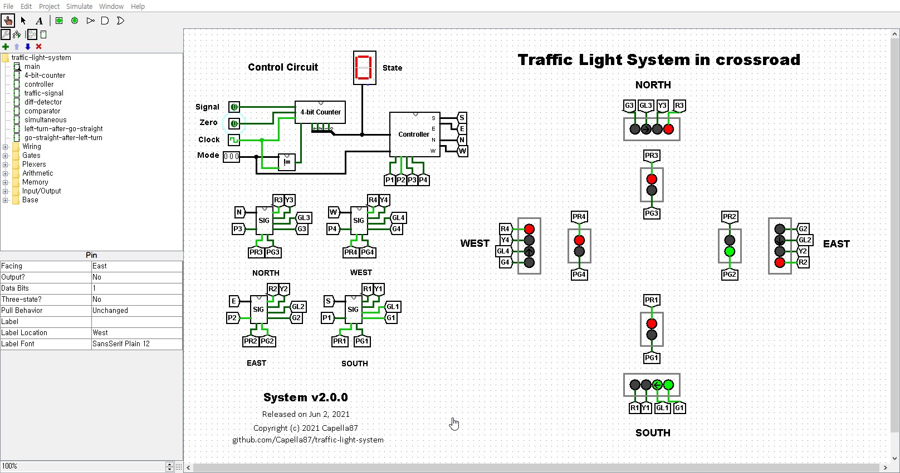

# 🚦Traffic Light System in Crossroad🚥

My project at Digital Systems in 2021 spring semester.

## Introduction
This project simulates traffic light system in a crossroad. it has multiple system routines, users can switch routines by change 'mode' signal.
All routines are followed South Korean system. Each side has a traffic light for cars and another light for pedestrians.

## Features
**Note**: All left turns in this system is **protected left turn**.

* Simultaneous (동시 신호): Cars are allowed to left-turn or go straight at same time.
* Left-turn-after-go-straight (직진 후 좌회전): Go straight turn at 2 sides, then changed to left turn. The most common system routine in South Korea nowadays.
* Go-straight-after-left-turn (좌회전 후 직진): Left turn at 2 sides first, then changed to go straight turn. It was a huge majority in South Korea until 1990s.
* Permitted-left-turn (비보호 좌회전): Turn only go straight green light at two side. Cars can turn left if there're no cars and pedestrians. Common on other countries.

* Red-flickering (적색 점멸등): Flickering Red light by clock signal. Other signals including pedestrian traffic lights are deactivated. Stop  once and go straight or turn left. Used on less volume traffic crossroads or midnight.
* Yellow-flickering (황색 점멸등): Flickering Yellow light by clock signal. Similar to Red-flickering, but cars don't have to stop once before pass through. Instead, they should drive slowly while going through. Used on less volume traffic crossroads or midnight.

* Pedestrian Traffic Lights: Has red and green light. There's no dedicated traffic light for bicycles. They are deactivated at flickering modes

## Requirements
To open this circuit file, [Logisim](http://www.cburch.com/logisim)—an open-source logical circuit simulator—is required. Also, that program requires Java Runtime Environment(JRE) to execute.
To meet this condition, you **MUST** download [JRE](https://java.com/en) (Free) provided by Oracle or [Java SE](https://www.oracle.com/java/technologies/javase-downloads.html) (requires paid subscription from 2019) from Oracle or any other OpenJDK distributors such as [Zulu](https://www.azul.com/downloads) and [AdoptOpenJDK](https://adoptopenjdk.net).
The simplest method is downloading JRE from Oracle.
This way does not require extra works to run.
But if you install OpenJDK instead of the Oracle's Java SE, There are extra configuration works needed for use because some applications based on Java like Logisim cannot be executed by double-clicking exe file or shortcuts.
To troubleshoot, Make a shortcut including arguments regarding Java from OpenJDK or run at command-line environment (e.g Windows Terminal, PowerShell or Command Prompt in Windows and Terminal app like bash and zsh in Linux or macOS).
For more details, See HELP Markdown file at the root directory. (Not uploaded yet. will be available from no later than the late first week of June, 2021)

## Operation

<b>▲ The glimpse of circuit as of v2.0.0</b>

---
Last updated on Jun 4, 2021

Copyright (c) 2021 Capella87
